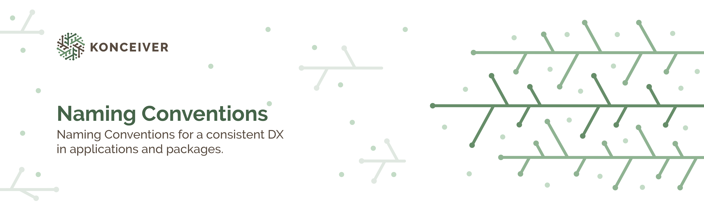

# Naming Conventions

> This document outlines naming conventions that should be followed across all applications and packages, internally and publicly.

## Package Names

TBD

## Avoid Abbreviations

TBD

## DX API Around Native Functionality

When a package is developed with the intent of improving the developer experience when interacting with a native API it should be prefixed with `better`. An example of this is the [Better Number Formatter](https://github.com/konceiver/better-number-formatter) package which provides a DX API around the native [NumberFormatter](https://www.php.net/manual/en/class.numberformatter.php) class.
